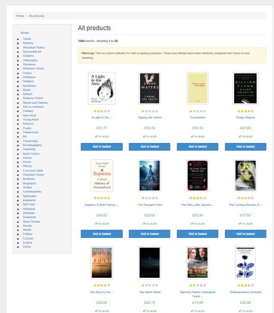
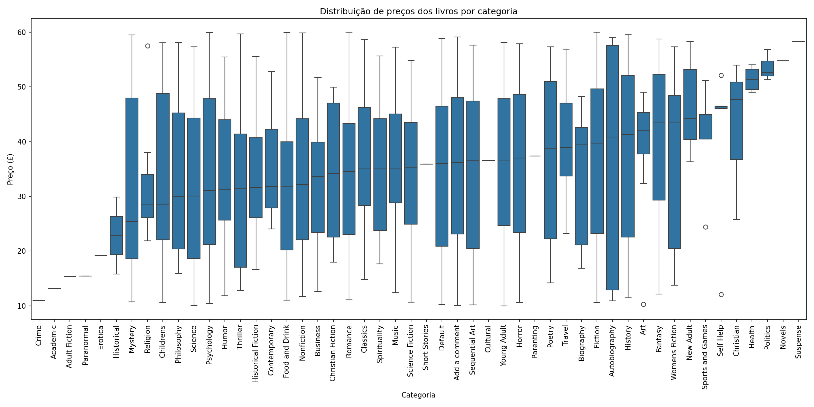
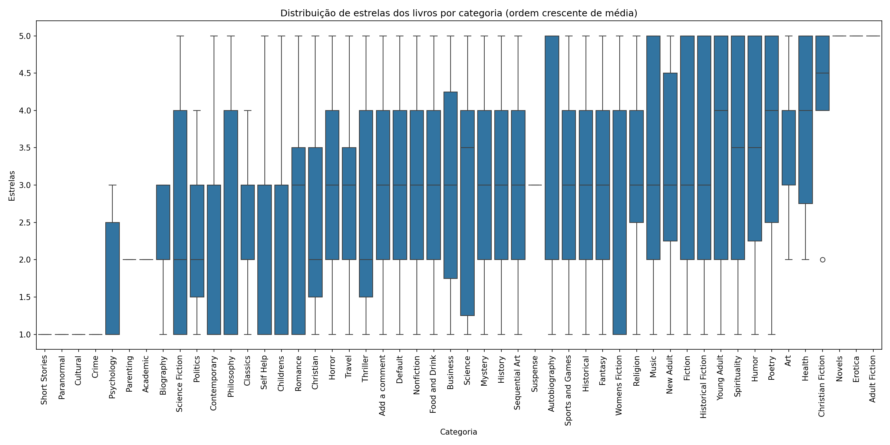
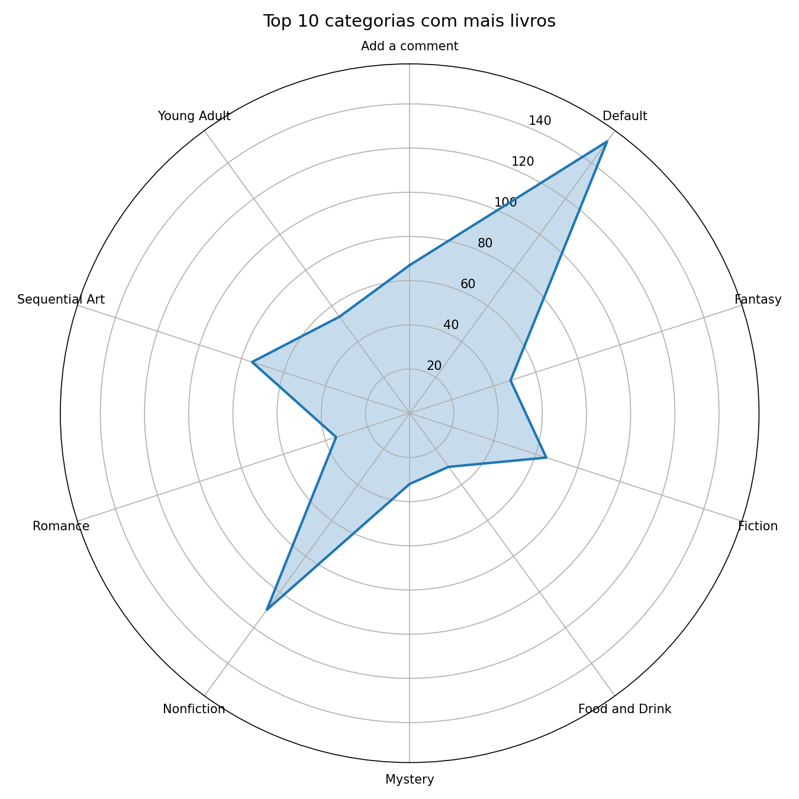
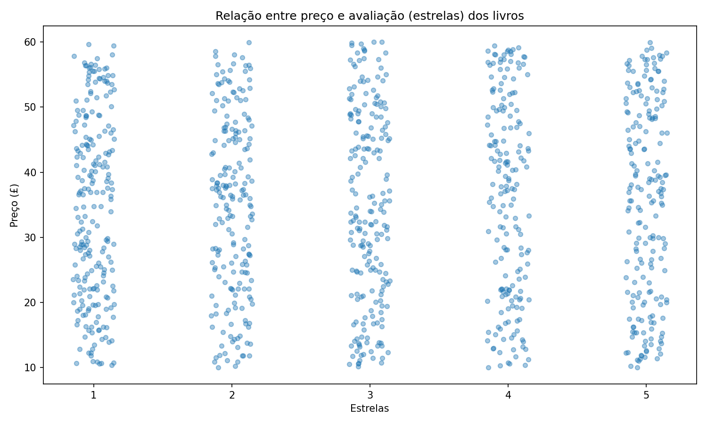
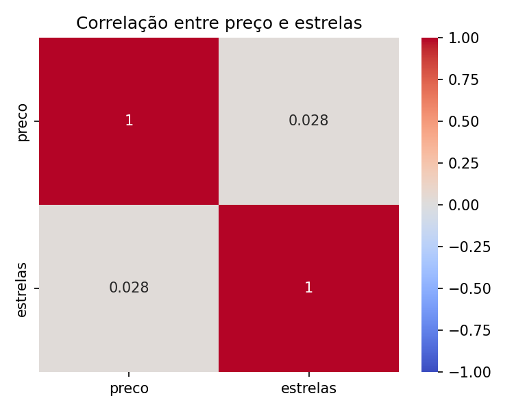

# 004-Crawler Example

Exercício de crawler para ler livros e gerar box-blot e radar.

Crawler para o site https://books.toscrape.com/

O script:
1. Acessa a página inicial e descobre todas as categorias de livros.
2. Para cada categoria, percorre todas as páginas (paginação) e coleta:
   - nome do livro
   - preço do livro
   - quantidade de estrelas (avaliação)
3. Monta um DataFrame do pandas com todos os dados coletados e grava  **livros_coletados.csv**

| nome                                                                                              | preco | estrelas | categoria |
|---------------------------------------------------------------------------------------------------|-------|----------|-----------|
| It's Only the Himalayas                                                                           | 45.17 | 2        | Travel    |
| Full Moon over Noahâs Ark: An Odyssey to Mount Ararat and Beyond                                  | 49.43 | 4        | Travel    |
| See America: A Celebration of Our National Parks & Treasured Sites                                | 48.87 | 3        | Travel    |
| Vagabonding: An Uncommon Guide to the Art of Long-Term World Travel                               | 36.94 | 2        | Travel    |
| Under the Tuscan Sun                                                                              | 37.33 | 3        | Travel    |
| A Summer In Europe                                                                                | 44.34 | 2        | Travel    |
| The Great Railway Bazaar                                                                          | 30.54 | 1        | Travel    |
| A Year in Provence (Provence #1)                                                                  | 56.88 | 4        | Travel    |
| The Road to Little Dribbling: Adventures of an American in Britain (Notes From a Small Island #2) | 23.21 | 1        | Travel    |
| Neither Here nor There: Travels in Europe                                                         | 38.95 | 3        | Travel    |
| 1,000 Places to See Before You Die                                                                | 26.08 | 5        | Travel    |
| Sharp Objects                                                                                     | 47.82 | 4        | Mystery   |
| In a Dark, Dark Wood                                                                              | 19.63 | 1        | Mystery   |
| The Past Never Ends                                                                               | 56.5  | 4        | Mystery   |
| A Murder in Time                                                                                  | 16.64 | 1        | Mystery   |

4. Gera um boxplot (seaborn) mostrando a distribuição de preços por categoria, em ordem crescente de preço médio
5. Gera um boxplot (seaborn) mostrando a distribuição de estrelas por categoria, em ordem crescente da média de estrelas
6. Gera um gráfico de radar mostrando a quantidade de livros por categoria, para as 10 categorias mais importantes
7. Gera um gráfico da distribuição de preços por estrelas
8. Faz a correlação de pearson entra preço e estrelas, gera o heatmap e calcula o pValue.

# Resultado - gráficos

# Correlação entre preço e satisfação (estrelas)

>[!WARNING]
>**p-valor: 0.3736**

Conclusão sobre as Hipóteses:
Como o p-valor (0.3736) é MAIOR que o nível de significância de 5.0%, NÃO REJEITAMOS a hipótese nula (H0).

**Conclusão**: Não há evidências estatísticas suficientes para afirmar que existe uma correlação linear entre o preço e a satisfação (quantidade de estrelas dos livros).

